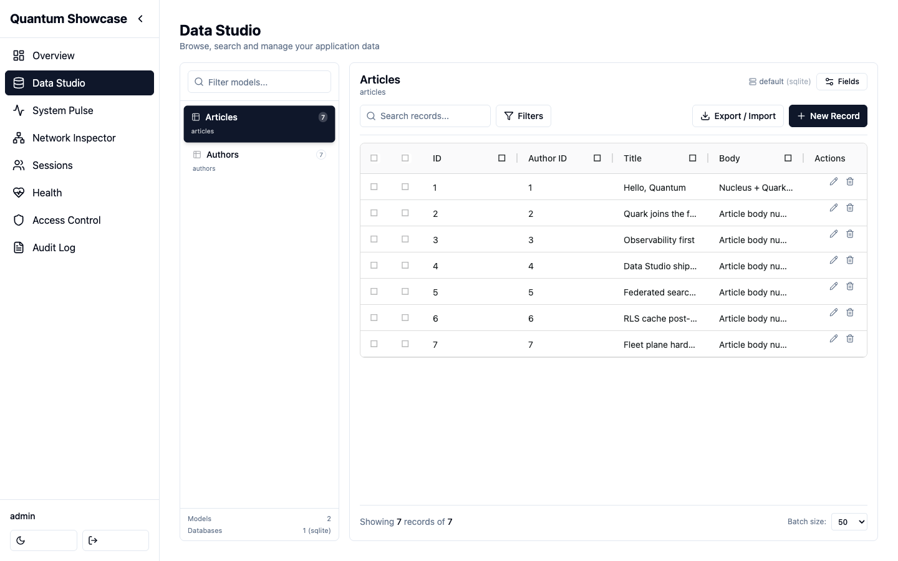
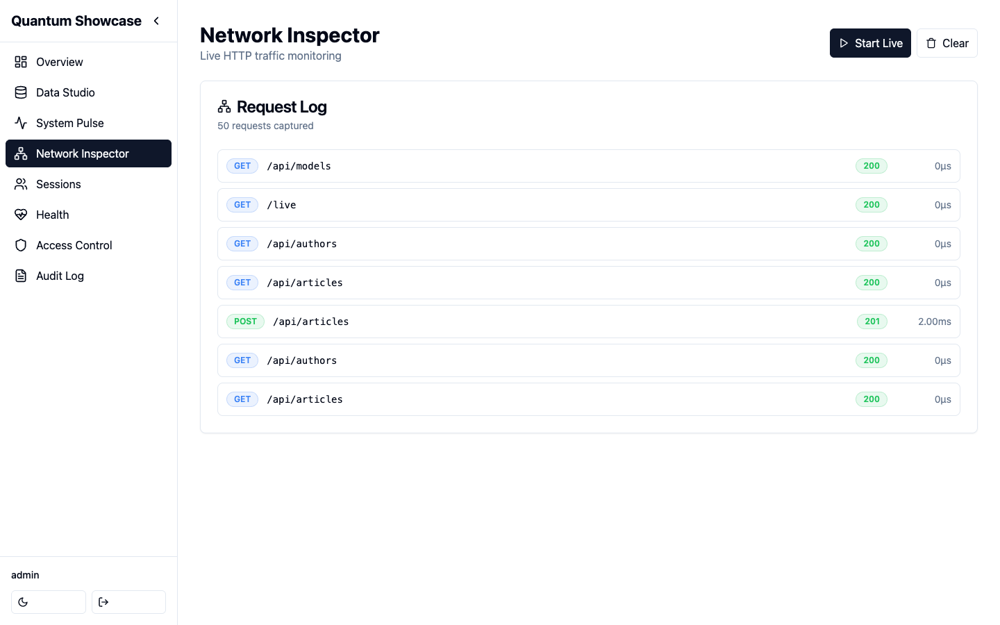
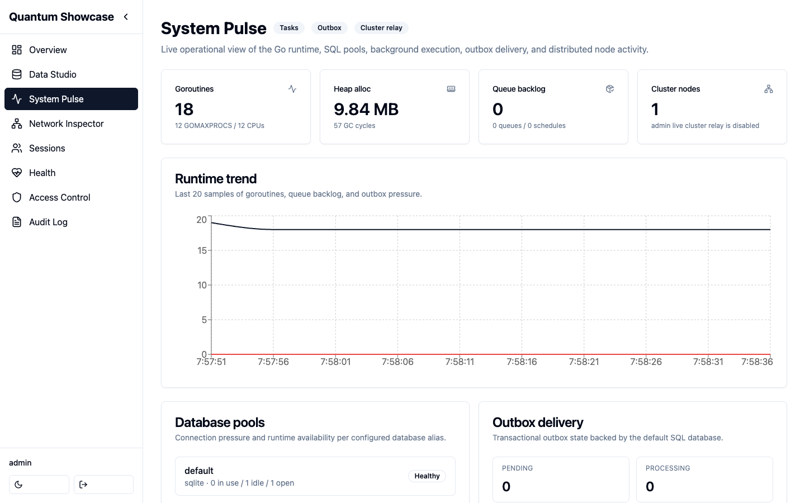

# Features

Orbit is a single panel made of focused modules. Each one reads live state from
the host application's `Runtime`. There is no separate data store to feed or
keep in sync.

## Data Studio

Browse, create, edit, and delete records for every model in the application's
registry. It is **tenant-aware** (when multitenancy is enabled) and supports
import/export.

**Tenant scope.** With `multitenant_enabled` on, every Data Studio operation is
confined to the tenant the host application resolves for the request (in
Nucleus, from the subdomain or the configured header), or to
`multitenant_default` when it resolves none. Confined means: the list and the
CSV export only show that tenant's rows; a record of another tenant is *not
found* by id (get, update, delete, bulk delete); a create or an update cannot
name another tenant under any key the backend resolves to the tenant field —
its storage column, its Go field name or, for a Nucleus model, the JSON key
its records carry, in any letter case — and a payload naming the field under
two of those keys is a 400. The tenant value itself is compared exactly:
both backends store it verbatim, so a padded spelling of the request's
tenant (`" acme "`) is another tenant and is refused the same way, and a
payload naming the request's tenant has that value replaced by the resolved
tenant before it reaches the backend, so the stored column is always the
tenant the request resolved. Both backends refuse a payload that names one
field twice (Nucleus 422, Quark 400) whichever keys it uses, so a key the
panel does not resolve cannot outvote the tenant it stamps; Quark's store
applies the keys of an update by column and Go name only, so a JSON-tag
alias in an update is dropped, never applied. A tenant column hidden from
JSON (`json:"-"`) is confined the same way: the records both backends emit
carry no tenant key, so a row is confirmed by id through a list filtered by
tenant and primary key instead of read off the record, the guard knows the
field by its column and Go name, and a create is stamped there — Quark's
store sets a schema column hidden from JSON on the entity itself, since
`json.Unmarshal` never would. Exports, imports and fixtures
work inside that tenant whatever `tenant_id` their request body carries — a
row that names another tenant fails, a row whose id belongs to another
tenant's record fails as *not found*, and an export job (`/api/exports`, its
status and its download) is listed and served only to requests scoped to the
tenant it was produced for. Models without a tenant column are not scoped. A
request the host resolves no tenant for, with no default configured, is
refused with a 403 rather than opened to every tenant — unless it comes from
a superuser or a subject granted `tenant_switch`, who is then unscoped (every
tenant) without an audit entry: only an explicit `?tenant=` switch is
recorded. Looking at another tenant, or at all of them, is that explicit
switch: `?tenant=<id>` or `?tenant=all` on the request, accepted only from a
superuser or a subject granted the `tenant_switch` action on `admin:*` (a
policy granting every action, `*`, on `admin:*` includes it), and recorded in
the [audit log](#audit-log) as `tenant.override`. Anyone else gets a 403.
The audit log itself is not filtered by tenant (see below). The confinement
is only as strong as the host's resolution: a
tenant read from a request header the client can set (Nucleus' `header`
resolver with no proxy overwriting that header) is the client's choice, so
resolve it from the host name, or from a header a trusted proxy sets, for the
scope to hold.

**Record ids.** Ids are strings everywhere the API exchanges them — record
paths, the bulk endpoint's `ids` and `errors[].id`, the export's `?ids=`,
fixture `pk` values — so a UUID key works like an integer one. Numbers are
still accepted on input. An id the backend cannot narrow to the model's key
type is a 400 on a single-record call and a per-id entry in `errors[]` on a
bulk one.

**Search.** `?search=` looks in the fields a model declares searchable: in
Nucleus, fields tagged `admin:"search"`, listed in `ModelConfig.SearchFields`,
or switched on in the panel's Field settings; Quark models search every
string column. A Nucleus model that declares none is not searchable today —
the registry does not yet default search to its string columns — so a search
on it answers `400` naming the model and how to enable search, rather than
every row, and the grid disables its search box. The two backends match
differently (Nucleus lower-cases both sides;
Quark escapes `%` and `_` in the text per engine), so do not expect identical
results across them.

What it lists comes entirely from the host application: a model appears
here when your app registers it (in Nucleus, by listing the struct in a
module's `Models`). An app that registers no models gets an empty Data
Studio — see
[the quick start](./quick-start.md#4-register-a-model-so-data-studio-has-something-to-show)
for the three lines that populate it.

Data Studio does not speak the framework's types directly. It reads and writes
through a neutral data-source contract (`orbit/datasource`), with the Nucleus
model registry as the default backend. Applications built on the
[Quark](https://github.com/jcsvwinston/quark) ORM can point it at their Quark
models instead: add the opt-in
[`quarkdatasource`](https://github.com/jcsvwinston/orbit/tree/main/quarkdatasource)
module and set `orbit.Config.DataSource`.

## Live runtime inspector

A real-time feed of incoming HTTP requests and executed SQL across the whole
application, sourced from the framework's observability event bus.

On a single node the feed is filled from three lanes:

- **HTTP requests** — from the framework's event bus.
- **SQL statements** — from the framework's event bus.
- **Session activity** — recorded by the panel's own surface.

The panel's own admin traffic is kept out of the request feed by default: the
admin prefix ships as the default exclude pattern. Remove that pattern to see
it.

Two keys shape the rest of the feed. `live_exclude_patterns` keeps noisy paths
(health checks, static assets) out, and `trace_url_template` deep-links each
entry into an external trace explorer.

### Seeing more than one node

The feed can aggregate across nodes in either of two ways, and they are
independent of each other:

- **The Redis live-feed relay** (`cluster_*` in
  [Configuration](./configuration.md)) — the nodes of one application share a
  single feed, with no extra process to deploy.
- **The [fleet plane](./cluster/overview.md)** — a standalone observability
  server that application nodes stream to.

### Bridging Quark ORM statements

The SQL lane is fed by the framework's event bus, which the framework's own
CRUD layer publishes to. Applications that run their queries through the
[Quark](https://github.com/jcsvwinston/quark) ORM can surface those statements
in the same live view with the opt-in
[`quarkbridge`](https://github.com/jcsvwinston/orbit/tree/main/quarkbridge)
module.

`quarkbridge` is a Quark middleware. It maps each executed statement to a
Nucleus SQL event, correlates it to the request, and publishes it through the
framework's public SQL ingest. It respects Quark's argument redaction and needs
no change to Orbit itself. OpenTelemetry remains complementary for durable
tracing.

## Session viewer

List active server-side sessions and revoke them individually.

## Access control (RBAC)

Inspect and manage the Casbin policies and roles that back the application's
authorizer. Orbit registers its own prefix with the framework's default-deny
RBAC, so the admin surface is gated like any other route.

## System metrics

Runtime and resource consumption at a glance — CPU, memory, goroutines, and the
database connection pool.

## Audit log

An in-memory ring of admin actions, sized by `audit_max_size` (default 10,000
entries). It is **not** persisted: it lives in one process, a restart or
deploy clears it, and in a multi-replica deployment each replica keeps its
own ring. Treat it as a live operational view, not a compliance store.

If you need a durable audit trail, write it at the data layer: applications
on the Quark ORM can enable its transactional `quark_audit` log
(`EnableAuditLog`), which survives restarts and is written in the same
transaction as the change. The panel's ring complements it — it also covers
panel-only actions (logins, session terminations, tenant switches recorded as
`tenant.override` with the requested tenant as `record_id`) that never touch
a model.

### What is recorded

Every write the panel performs leaves an entry, recorded by the handler that
performed it. The `action` names the operation:

| Surface | Actions |
|---|---|
| Data Studio | `create`, `update`, `delete` (each with the record's values before and/or after the change), `bulk_delete` (one summary plus one `delete` per row), `bulk_export`, `export.csv`, `schema.update` (field metadata edits, with the fields before and after) |
| Access control | `rbac.policy.add`, `rbac.policy.remove`, `rbac.role.assign`, `rbac.role.remove` |
| Feature flags and jobs | `flag.create`, `flag.set`, `flag.delete`, `jobs.queue.<action>` |
| Operations | `migration.apply`, `cache.flush`, `live.exclude.add`, `live.exclude.remove`, `audit.clear` (the one entry that survives the clear) |
| Data management | `export.create`, `fixtures.dumpdata`, `import.upload`, `import.validate`, `import.execute`, `fixtures.loaddata` — exports are recorded whether they completed or failed |
| Sessions | `login`, `login.failed`, `login.locked`, `logout`, `session.terminate` |
| Tenant scope | `tenant.override` (an accepted `?tenant=` switch, with the requested tenant as `record_id`; a refused switch leaves no entry) |

`old_value` and `new_value` are redacted before they are stored, because the
log is readable by any operator with `audit_view`: fields the model excludes
from Data Studio and credential-shaped names (password, secret, token, hash,
salt…) appear as `[redacted]`, string values longer than 4 KB are truncated,
a Redis URL loses its password, a session token is shortened, imports and
exports record counts rather than rows, and login entries carry the attempted
username, never the password.

Entries are not filtered by tenant. With `multitenant_enabled`, an operator
granted `audit_view` reads every entry the ring holds — the redacted old and
new values of rows written by other tenants' operators, and every
`tenant.override` — not only the entries of the tenant the request resolved
to.

Entries are bounded as well as redacted. The user id, username, model,
record id and client IP are cut at 256 bytes and the User-Agent at 512, with
a `…[truncated]` marker on anything cut. The login route is the one place an
anonymous client writes to the log, so it is bounded twice more: the panel
caps the login POST body at 16 KB (whichever layer parses the form first,
the entry a failed attempt leaves is cut to the field bounds above), and
per client IP and lockout window (one minute) the log keeps at most 10
`login.failed` entries and one `login.locked` — the lockout keeps answering
429 for the rest of the window without adding entries, and a successful
login from that IP starts the count again. The client IP is the full
remote address: a client that rotates source addresses, as an IPv6 `/64`
allows, is bounded per address, not per client. A single address can
neither inflate the ring's memory nor push the entries recorded before its
attempts out of it.

`GET /api/audit` pages newest first; `total` and `total_pages` count the
entries that match the `user_id`, `model` and `action` filters, so a filtered
listing does not page into nothing. `POST /api/audit/clear` answers
`{"cleared": true, "dropped": <n>}`.

## Overview & Health

A dashboard summarizing the above, plus a health-at-a-glance view.
