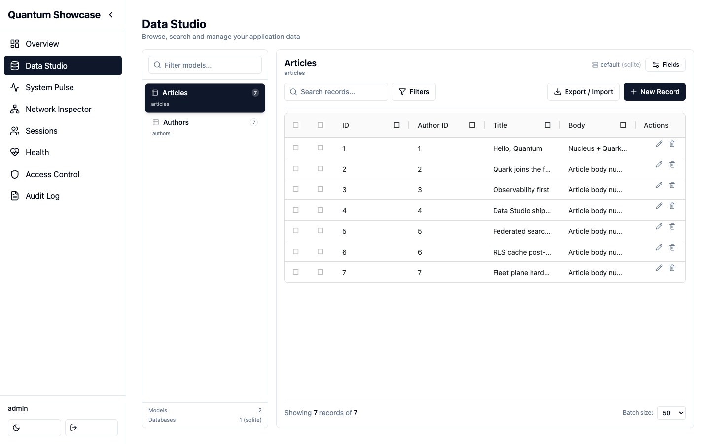
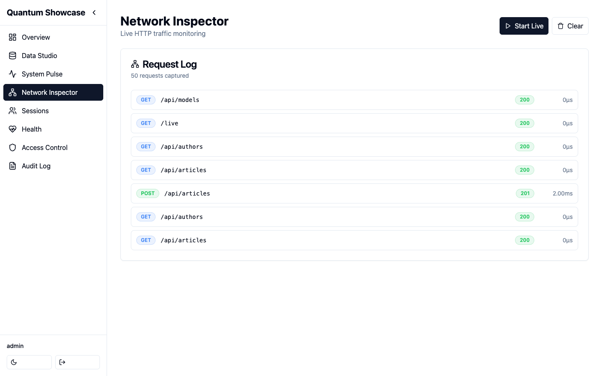
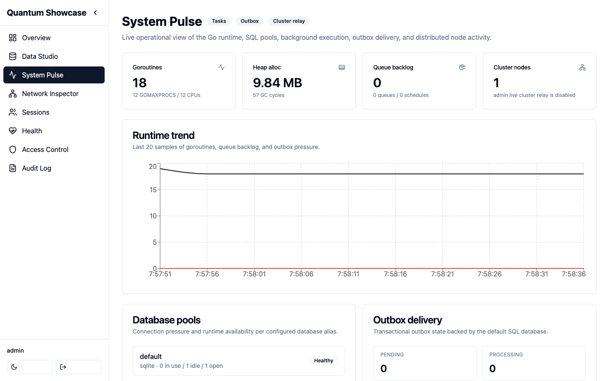

# Features

Orbit is a single panel made of focused modules. Each one reads live state from
the host application's `Runtime`. There is no separate data store to feed or
keep in sync.

## Data Studio

Browse, create, edit, and delete records for every model in the application's
registry. It is **tenant-aware** (when multitenancy is enabled) and supports
import/export.

**Tenant scope.** With `multitenant_enabled` on, every Data Studio operation is
confined to the tenant the host application resolves for the request (in
Nucleus, from the subdomain or the configured header), or to
`multitenant_default` when it resolves none. Confined means: the list and the
CSV export only show that tenant's rows; a record of another tenant is *not
found* by id (get, update, delete, bulk delete); a create or an update cannot
name another tenant under any key the backend resolves to the tenant field —
its storage column, its Go field name or, for a Nucleus model, the JSON key
its records carry, in any letter case — and a payload naming the field under
two of those keys is a 400. The tenant value itself is compared exactly:
both backends store it verbatim, so a padded spelling of the request's
tenant (`" acme "`) is another tenant and is refused the same way, and a
payload naming the request's tenant has that value replaced by the resolved
tenant before it reaches the backend, so the stored column is always the
tenant the request resolved. Both backends refuse a payload that names one
field twice (Nucleus 422, Quark 400) whichever keys it uses, so a key the
panel does not resolve cannot outvote the tenant it stamps; Quark's store
applies the keys of an update by column and Go name only, so a JSON-tag
alias in an update is dropped, never applied. A tenant column hidden from
JSON (`json:"-"`) is confined the same way: the records both backends emit
carry no tenant key, so a row is confirmed by id through a list filtered by
tenant and primary key instead of read off the record, the guard knows the
field by its column and Go name, and a create is stamped there — Quark's
store sets a schema column hidden from JSON on the entity itself, since
`json.Unmarshal` never would. Exports, imports and fixtures
work inside that tenant whatever `tenant_id` their request body carries — a
row that names another tenant fails, a row whose id belongs to another
tenant's record fails as *not found*, and an export job (`/api/exports`, its
status and its download) is listed and served only to requests scoped to the
tenant it was produced for — and, beyond the tenant, only to the operator who
cut it ([What an export holds](#what-an-export-holds)). Models without a
tenant column are not scoped. A
request the host resolves no tenant for, with no default configured, is
refused with a 403 rather than opened to every tenant — unless it comes from
a superuser or a subject granted `tenant_switch`, who is then unscoped (every
tenant) without an audit entry: only an explicit `?tenant=` switch is
recorded. Looking at another tenant, or at all of them, is that explicit
switch: `?tenant=<id>` or `?tenant=all` on the request, accepted only from a
superuser or a subject granted the `tenant_switch` action on `admin:*` (a
policy granting every action, `*`, on `admin:*` includes it), and recorded in
the [audit log](#audit-log) as `tenant.override`. Anyone else gets a 403. Without an auth provider (the open posture, warned at mount) there is no operator to gate: `?tenant=` is accepted from any client and a request with no resolved tenant is unscoped.
The audit log itself is not filtered by tenant (see below). The confinement
is only as strong as the host's resolution: a
tenant read from a request header the client can set (Nucleus' `header`
resolver with no proxy overwriting that header) is the client's choice, so
resolve it from the host name, or from a header a trusted proxy sets, for the
scope to hold.

**Record ids.** Ids are strings everywhere the API exchanges them — record
paths, the bulk endpoint's `ids` and `errors[].id`, the export's `?ids=`,
fixture `pk` values — so a UUID key works like an integer one. Numbers are
still accepted on input. An id the backend cannot narrow to the model's key
type is a 400 on a single-record call and a per-id entry in `errors[]` on a
bulk one.

**Search.** `?search=` looks in the fields a model declares searchable: in
Nucleus, fields tagged `admin:"search"`, listed in `ModelConfig.SearchFields`,
or switched on in the panel's Field settings; Quark models search every
string column. A Nucleus model that declares none is not searchable today —
the registry does not yet default search to its string columns — so a search
on it answers `400` naming the model and how to enable search, rather than
every row, and the grid disables its search box. The two backends match
differently (Nucleus lower-cases both sides;
Quark escapes `%` and `_` in the text per engine), so do not expect identical
results across them.

A search looks in every searchable field, and the panel cannot tell the
backend to skip one. So a search that would also look in a field the
operator may not read — kept from them by a field policy, or excluded from
the panel — answers `400` instead of the rows it would find by that field's
value (see [what an operator may ask](#what-an-operator-may-ask)); the
schema's `searchable` says so, and the grid disables the box.

**Filters that carry an operator.** A filter used to mean one thing — this
column equals this value — and the query string carries the comparison now:

```
GET /api/models/Invoice?status=unpaid&total__gt=1000&due_date__lte=2026-06-30
GET /api/models/Article?title__contains=hammer&archived_at__isnull=true
GET /api/models/Order?status__in=open,paused&customer__startswith=ACME
```

The operator goes after the field, separated by two underscores. The twelve are
`eq`, `ne`, `gt`, `gte`, `lt`, `lte`, `contains`, `startswith`, `endswith`,
`in`, `not_in` and `isnull`; `in` and `not_in` take a comma-separated list, and
`isnull` a boolean. A plain `?field=value` still means equality, and the two
forms are ANDed, so `?status=open&views__gt=100` is one query.

Three things to know before you rely on it:

- **An operator this panel does not know is refused**, not read as equality. A
  filter that is quietly dropped answers every row and looks like a result.
- **A wildcard in the value is data.** `?title__contains=50%25` looks for the
  per-cent sign. On PostgreSQL, MySQL and SQL Server it is escaped; on an
  engine whose `LIKE` has no escape character (SQLite, Oracle) the Quark-backed
  data source refuses the query instead of answering it wrongly.
- **An empty `in` matches nothing.** `?status__in=` is a question with an
  answer, not an absent filter.

A field the model does not offer as a filter is refused through the operator
form exactly as it is through the plain one, and an excluded field is answered
as if the column did not exist — see below.

The grid's own filter row still sends equality; the operator forms are typed
into the URL, and a [saved view](#saved-views) keeps one — which is what a
query an operator returns to every morning usually is.

**A total the pager can divide.** A filtered list used to answer `total: -1`
with `is_estimated: true`, which no pager can turn into a page count. The list
endpoint now asks the data source for a real count over the same filters the
page uses, so `total` and `total_pages` describe the query you sent. It costs
one extra count per page request — paid by the screen that draws a pager, and
not by the exports, imports and fixtures that walk every page without one.

**What the grid refuses.** A column the panel does not show is not a sort key
and not a filter. `?order_by=` and the filter parameters resolve only against
the fields the panel would render, so a request naming an excluded field —
`password_hash`, say — is refused instead of reaching the store's `ORDER BY`,
where it would have paginated the table in that hidden column's order and
turned the page numbers into a comparison oracle over a value the schema
endpoint, the exporters and the audit redactor all take care never to emit.
The import validator reads a cell against the width its column declares, in
arbitrary precision rather than through the validator's own conversions, so
`300` in an `int8` column and `70000` in a `uint16` one fail the row instead
of reaching the writer.



What it lists comes entirely from the host application: a model appears
here when your app registers it (in Nucleus, by listing the struct in a
module's `Models`). An app that registers no models gets an empty Data
Studio — see
[the quick start](./quick-start.md#4-register-a-model-so-data-studio-has-something-to-show)
for the three lines that populate it.

Data Studio does not speak the framework's types directly. It reads and writes
through a neutral data-source contract (`github.com/jcsvwinston/orbit/datasource`, a module of its own that neither the panel nor its SPA come with), with the Nucleus
model registry as the default backend. Applications built on the
[Quark](https://github.com/jcsvwinston/quark) ORM can point it at their Quark
models instead: add the opt-in
[`quarkdatasource`](https://github.com/jcsvwinston/orbit/tree/main/quarkdatasource)
module and set `orbit.Config.DataSource`.

`datasource.Query` is a frozen shape, so the operator filters and the exact
count arrived as new fields beside the old ones rather than as a richer
`Filters`: `Where []Filter` and `ExactTotal bool`. A data source written before
them keeps compiling and keeps answering what it answered, which is the point
of adding rather than changing — but a list it serves will then ignore an
operator filter the panel sent, so a third-party implementation should read
both. Two rules it has to keep, because each is a way to answer more rows than
were asked for while looking like a filter: a pattern operator matches its
value LITERALLY (a `%` in the text is a per-cent sign), and an `in` with no
values matches nothing rather than being dropped. `ExactTotal` may be ignored
by a source that always counts exactly, which is what `quarkdatasource` does.

## Live runtime inspector

A real-time feed of incoming HTTP requests and executed SQL across the whole
application, sourced from the framework's observability event bus.



On a single node the feed is filled from three lanes:

- **HTTP requests** — from the framework's event bus.
- **SQL statements** — from the framework's event bus.
- **Session activity** — recorded by the panel's own surface.

The panel's own admin traffic is kept out of the request feed by default: the
admin prefix ships as the default exclude pattern. Remove that pattern to see
it.

Two keys shape the rest of the feed. `live_exclude_patterns` keeps noisy paths
(health checks, static assets) out, and `trace_url_template` deep-links each
entry into an external trace explorer.

### Seeing more than one node

The feed can aggregate across nodes in either of two ways, and they are
independent of each other:

- **The Redis live-feed relay** (`cluster_*` in
  [Configuration](./configuration.md)) — the nodes of one application share a
  single feed, with no extra process to deploy.
- **The [fleet plane](./cluster/overview.md)** — a standalone observability
  server that application nodes stream to.

### Bridging Quark ORM statements

The SQL lane is fed by the framework's event bus, which the framework's own
CRUD layer publishes to. Applications that run their queries through the
[Quark](https://github.com/jcsvwinston/quark) ORM can surface those statements
in the same live view with the opt-in
[`quarkbridge`](https://github.com/jcsvwinston/orbit/tree/main/quarkbridge)
module.

`quarkbridge` is a Quark middleware. It maps each executed statement to a
Nucleus SQL event, correlates it to the request, and publishes it through the
framework's public SQL ingest. It respects Quark's argument redaction and needs
no change to Orbit itself. OpenTelemetry remains complementary for durable
tracing.

## Session viewer

List active server-side sessions, see whose each one is and from what device,
and revoke one — or every session of one account at once.

| What you do | Route |
|---|---|
| List sessions | `GET /admin/api/sessions` |
| End one session | `DELETE /admin/api/sessions/{id}` |
| End every session of one user | `POST /admin/api/sessions/revoke-all` with `{"user": "<name>"}` |

A row carries `user` (the operator the panel signed in, or the identity key
the application stores in its own sessions), `device` (a short label such as
`Firefox on Linux` derived from the user agent the panel recorded, with the
raw `user_agent` beside it), `remote_ip`, the node that served it, and
`current: true` on the session the listing request was made with, so the
viewer can say "this is you" instead of asking the operator to match a token
prefix. The row never carries the session token itself: `id` is a one-way
handle the terminate endpoint resolves server-side.

**Revoke-all matches on the name the row shows.** The `user` you pass is the
same string the list serves, so what you read is exactly what the call acts
on. The session the request is made with is always kept: revoking your own
account signs out every *other* device, and a request that revoked itself
would leave the screen with nobody behind it. The answer says how many
sessions were ended and whether yours was among the matches and kept
(`{"user": "ana", "revoked": 2, "kept_current": true}`); a user with no
open session is an honest `revoked: 0`, not an error. Both routes need the
`terminate_sessions` action and both are audited — the bulk one as
`session.revoke_all` with the user as the record and the count in the entry,
whether or not the call completed.

The device column depends on the panel seeing a request from that session:
the panel stamps the user agent on every request that goes through it, under
the same key the framework's own session middleware uses, so a session that
signed in and has not touched the panel yet shows no device until it does.

## Operators

The people who sign in to the panel are managed from it: create an account,
give it a role, reset a password somebody forgot, deactivate the account of
somebody who left. Until this existed the panel could edit the policies and
not the people they applied to — an account could only be created with
`nucleus createuser` on the server.

| What you do | Route |
|---|---|
| List operators, with the roles each one holds | `GET /admin/api/admin-users` |
| Create one (optionally with roles) | `POST /admin/api/admin-users` |
| Change an email, promote or demote a superuser | `PUT /admin/api/admin-users/{id}` |
| Set a new password | `POST /admin/api/admin-users/{id}/password` |
| Deactivate / reactivate | `POST /admin/api/admin-users/{id}/disable` · `/enable` |
| Grant or revoke a role | `POST` · `DELETE /admin/api/admin-users/{id}/roles` |
| Delete the account | `DELETE /admin/api/admin-users/{id}` |

**Deactivating is not deleting.** A deactivated operator cannot sign in and
their existing session stops working on its next request — the panel re-reads
the account on every request — but the account and everything the audit log
records about it stay. Deleting removes the row; the trail of what that person
did remains.

Two refusals are built in, because locking everyone out is a single click:
you cannot deactivate, delete or demote **your own** account, and nobody can
deactivate, delete or demote the **last active superuser**. Both answer `409`
with the reason.

Passwords set here are hashed like any other credential and are never written
to the audit log — the entry records that a password changed, not what to.

Operator management needs an admin authentication provider that owns the
accounts, which is the default one (backed by `nucleus_admin_users`). An
application that authenticates its operators elsewhere gets `501` on these
routes rather than a second, competing account store.

### Saved views

The filter set an operator returns to every morning used to live in the URL
and nowhere else. A saved view stores a name, the model and the query string
the grid was showing:

```
GET    /api/views?model=Invoice
POST   /api/views      {"model":"Invoice","name":"Unpaid over 90 days","query":"status=unpaid&order_by=due_date+asc"}
PUT    /api/views/{id}
DELETE /api/views/{id}
```

The query is stored as **text** and is not parsed against today's schema: a
view is a shortcut to a URL, so one that stops making sense fails on the list
endpoint with that endpoint's message rather than being silently dropped.

A view belongs to whoever saved it. `is_shared` makes it visible to everyone;
editing and removing stay with its owner (a superuser may tidy up any), and
each view the list returns says whether this operator may (`can_edit`), so
Data Studio offers a view's removal only to whoever the server lets remove
it. There is no permission of its own — creating a view needs the **list** permission of
the model it points at, and a view of a model an operator cannot list is not
shown to them, because the row would disclose both the model and what somebody
filters it by. Every change is audited (`view.create`, `view.update`,
`view.delete`).

Views need a database handle to live in; a panel without one answers `501`
rather than failing later.

### Forms that hold a relation, a document and a file

A form needs three things a table of scalars does not.

**What a foreign key points at.** The schema marks the key (`is_fk`), and two
endpoints resolve it:

```
GET /api/models/{model}/options?q=&limit=            the candidates of a model
GET /api/models/{model}/fields/{field}/options       the candidates a field may point at
```

Each option carries the `value` a record stores and a `label` a person reads
(the model's first searchable text field, then its first listed one, of the
fields the operator reads). The
permission is the **target's**: resolving what an Author id means is reading
Authors, so an operator who may edit the record and not browse the target gets
a `403` and a form that falls back to the raw id — the panel does not widen a
grant to render a nicer widget. Search, tenant confinement, row scope and field
policies apply exactly as they do to a list; a field the operator may not read
answers `404` on the second endpoint, as one the model does not have.

**Children, edited with the parent.** A model whose foreign key names another
appears in the parent's schema as an inline, and the parent's own payload
carries the children:

```json
{ "title": "Kind of Blue",
  "tracks": [ { "title": "So What" },
              { "id": 12, "title": "Blue in Green" },
              { "id": 13, "_delete": true } ] }
```

A row with an id is an edit, one without is an insert, and a row that should
go **says so** — absence never deletes, because a form that loaded two of five
lines would otherwise remove the three it never showed. The key pointing at
the parent is stamped by the panel: a child that names another record there
is refused with `400`, and a child named by id must be one of the record being
edited — any other row, including one that does not exist, answers `404`, for
a superuser too. A record being created has no children to edit or remove yet.

Each child is written the way the **child model's** own form would write it:
with that model's `create`, `update` or `delete`, inside the request's tenant,
within the operator's own rows under an ownership grant, and with no field the
operator may not write (refused by name, as on the form). Every child is
checked before the parent is written, and one that is refused refuses the
whole save — the error names it (`tracks[1]: …`) and nothing is written.

Past those checks this is deliberately **not transactional**: the panel's data
contract writes one row at a time, so the parent is saved first and each child
reported on its own in the response (`inlines`). A child the database then
rejects does not roll the parent back. A form that needs all-or-nothing for
those failures needs a transactional data source underneath it, and saying so
is better than implying otherwise.

**Documents, rich text and files.** The schema's widget vocabulary was scalar;
it now also names `json`, `richtext`, `file` and `image`. A JSON document is
inferred from the column type; the other two are claims about intent that no
type carries, so the application declares them:

```yaml
modules:
  orbit:
    field_widgets:
      Album.Notes: richtext
      Album.cover: image
```

A value may also name a field renderer your own script registers, which
draws the field your way in the list and on the record view (see
[Code of your own in the browser](#code-of-your-own-in-the-browser)).

The declaration is checked when the panel mounts. A widget outside those four
that is not a renderer you declared, a key that names no field of your
models, or two keys for one field with different widgets stops the
application with a message naming the entry — each of them is a form that
would otherwise quietly show the column's plain input.

A file field holds a storage **key**, and `POST /api/models/{model}/upload`
(multipart, `file` plus an optional `field`) produces one: the bytes go to the
application's own storage and the answer carries the key the form writes into
the record. The route refuses a field that does not hold a file, caps an
upload at 32 MB, keeps only the base name of what the client called it, and is
audited (`field.upload`).

## Access control (RBAC)

Inspect and manage the Casbin policies and roles that back the application's
authorizer. Orbit registers its own prefix with the framework's default-deny
RBAC, so the admin surface is gated like any other route.

A policy is `(subject, object, action)`. The subject is an operator's id, role
or username; the action is the verb a handler checks (`list`, `retrieve`,
`create`, `update`, `delete`, `export_csv`, `bulk_delete`, `bulk_export`, and
the panel-wide ones such as `list_models` or `audit_view`). The object names
what the verb applies to, at three levels of resolution:

| Object | Means |
|---|---|
| `admin:Post` | the whole model, every row and every field |
| `admin:Post#own` | the same verb, confined to the rows that belong to this operator |
| `admin:Post.title` | one field of the model |

A superuser bypasses all three, as it always has.

### Per-row permissions

`admin:Post#own` is the grant an editorial admin needs: an author lists, opens
and edits their own posts and does not see anybody else's. Lists are filtered
by the owner column, a row owned by somebody else answers `404` on the record
endpoints (the same answer as a row that does not exist, so ids are not
disclosed), a create stamps the operator as the owner, and an update cannot
hand a row over. Every export carries the same rows the list does.

Which column says who owns a row is the application's answer, not a guess:

```yaml
modules:
  orbit:
    row_owner_fields:
      Post: author        # the column of Post that holds the operator
      "*": owner          # the default for every other model
    row_owner_subject: username   # or "id"
```

A `#own` grant on a model with no entry there is **refused** with a `403` that
says why. It is never widened to every row: an ownership rule that silently
degrades to "everything" is the failure this is built to prevent.

### Per-field permissions

A policy whose object names a field narrows one column, in either of the two
shapes an admin needs — the exception, or the whole permitted set:

| Policy | Means |
|---|---|
| `(editors, admin:Post.price, deny)` | editors neither read nor write `price` |
| `(editors, admin:Post.title, update)` | an allow-list: editors update `title`, and nothing else |
| `(editors, admin:Post.title, create)` | the same, for creates |
| `(editors, admin:Post.title, write)` | both of the two above |
| `(editors, admin:Post.title, read)` | a read allow-list: only the named fields are emitted |

An allow-list only applies to a subject that holds at least one field policy of
that action for the model; a subject with none keeps the model-level grant it
always had. A write that names a field the operator may not write is refused
with a `403` **naming the field** — not dropped silently, because a form that
believes it saved a value it did not save is worse than one that is told. A
field the operator may not read is left out of the record, the list, every
export and the schema.

### What an operator may ask

A field the operator may not read is not one they can ask about either. The
rows a filter leaves say what the field holds, one guess at a time
(`?price__gt=1000` answering one row is the price), and a sort pages the rows
in the field's order. So, for that operator:

- a list filter on it, with or without an operator (`?price=`,
  `?price__gt=`), answers `400 invalid filter field` — the answer a field the
  model does not have gets, so the refusal does not say the field exists;
- an `order_by` that names it answers `400 invalid order_by`, the same way;
- a `?search=` that would also look in it answers `400`, and the schema's
  `searchable` is `false` (the backend searches every searchable field; the
  panel cannot narrow it to the readable ones);
- the panel's export refuses a `filters` entry on it with the list's `400`;
- a relation lookup (`/options`) labels its options with a field the operator
  reads, and its `?q=` is the list's search;
- a saved view that filters or sorts by it is not listed to them;
- a dashboard's records card ordered by it is not shown to them, as a card of
  a model they may not list is not.

An excluded field counts for every operator, superusers included, since no
one reads it in the panel. The superuser is otherwise unaffected: field
policies do not apply to them.

Field policies narrow a grant; they never widen one. An operator who cannot
update the model at all is refused before any field is consulted.

### What an export holds

`export_data` is granted on `admin:*`: it says who may export, not what. The
panel's export (`POST /api/exports`, in CSV, JSON and SQL) and the fixture
dump (`POST /api/fixtures/dumpdata`), which rides on the same grant, carry for
each model what that operator's `list` of it shows — the rows of their tenant,
only their own rows under an `#own` grant, and only the fields they may read:
a hidden field is neither a value nor a column of the CSV, a key of the JSON
record, a column of the SQL table, or a field of the fixture. The model's own
CSV export (`export_csv`) reads through the same scope. The export's own
`filters` narrow it further and cannot widen it: one on a confined column is
replaced by the scope's, and one on a field the operator may not read is
refused with a `400`, since the rows it leaves would say what the field holds.

A model the request names that the operator may not list is refused with the
`403` the list gives — including the one an `#own` grant gets on a model with
no owner column — and nothing is exported. An export of every model (no
`models` in the request) leaves those models out, the way the sidebar does.

An export, once cut, is a copy of what its producer could read. The job list,
a job's status and its download are handed to the operator who cut it and to
a superuser, and to no other holder of `export_data`. The panel keeps the job
list in memory, so after a restart, or from another replica, an operator who
is not a superuser cuts the export again; the signed URL a store returns with
the export is unaffected.

### What an import writes

`import_data` is granted on `admin:*` too, and says who may import, not what.
The import (`POST /api/imports`, then `/api/import/validate` and
`/api/import/execute`) and the fixture load (`POST /api/fixtures/loaddata`,
the same operation in another format) write each row the way the record form
would write it for that operator:

- a **new** row needs the model's `create`, and an **existing** one its
  `update`;
- the row stays in the request's tenant: one naming another tenant is
  refused, never moved into this one, and one naming none has the tenant
  stamped, as a create does;
- under an `#own` grant, only the operator's own rows are updated, and a new
  row has the operator stamped as its owner; one naming another owner is
  refused;
- a field the operator may not write is refused by name, not dropped.

A row is **existing** when `on_conflict` asks the import to look for it
(`skip` or `update`) and its primary key — under the key's name, its column
or its Go name — names a row the store holds, or else every column of one of
the model's unique indexes is in the row and matches a row of the tenant. A
fixture record is existing when its `pk` names a row the store holds. An
existing row of another tenant is not found, whatever `on_conflict` says, and
one outside the operator's own rows is not found for an update. A row
`on_conflict=skip` leaves alone writes nothing and needs no grant. Every
other row is a create.

The file is planned whole before any row of it is written. **One row the
operator may not write refuses the whole file** with a `403` that names the
row (counted from 1), the model, and the permission, field or scope it
lacks — nothing of the file is written. The validate step plans the file the
same way and answers the same `403`. A cell of the wrong type, a fixture `pk`
the store cannot use and a write the store itself refuses are still failed
rows of the report: none of them is a question of who is writing.

A superuser is unaffected, apart from the tenant: model grants, `#own` and
field policies do not apply to them, and a row of another tenant refuses
their file whole as it does anybody's.

### What a screen is told

The payloads a model screen loads carry what this operator may do, so the panel
can disable what it may not instead of finding out by being refused:

- `GET /api/models` and `GET /api/models/{name}/schema` carry `permissions`
  (action → boolean), `can_create`, `can_update`, `can_delete`, and `row_scope`
  — the actions confined to the operator's own rows;
- each field of the schema carries `can_edit` (`can_read` is true for every
  field that arrives: the ones it is false for are not in the schema);
- the schema carries `searchable`: whether `?search=` is answered for this
  operator. A field kept from them is not in their schema, so the fields
  alone cannot say that a search would reach one.

The `permissions` map carries the record verbs, the actions this application
declared, and the screen's other doors, each asked of the resource its
handler asks it of: `get_schema` and `update_schema` of the model,
`export_data` and `import_data` of the whole panel (`admin:*`). Those four are
full grants only — an `#own` grant of them is not one, here or on the
request. `export_data` is also false on a model the operator may not `list`,
since its export is refused there, and `import_data` on a model they may
neither `create` nor `update` rows of, since every row of its import is. `update_schema` is false for everybody on
a data source with no schema registry, which answers `501` to it.

Data Studio draws its screens from them, and offers a door only to an
operator the server will let through it:

| What it offers | The verb it needs |
|---|---|
| a model in the sidebar | `get_schema` and `list` |
| **Fields**, the field settings | `update_schema` |
| **New Record** | `create` |
| **Export** (the panel's export of the model) | `export_data` on `admin:*`, and `list` of the model, whose rows and fields it holds |
| **Import** | `import_data` on `admin:*` and `create` on the model — the dialog's import creates every row it reads — on a model that is not read-only |
| a row's **History** | `retrieve`, the record's own verb |
| a row's **Edit** | `update` |
| a row's **View**, the record read-only | `retrieve` and no `update` |
| a row's **Delete** | `delete` |
| a selection, and its **Delete** | `bulk_delete`, the verb the server asks of a batch |
| an application action | its own verb, where it is placed; a destructive one not on a read-only model |
| a saved view's removal | being its owner, or a superuser (`can_edit` on the view) |
| a child's **Add**, **Remove** and edit in the record's form | the child model's `create`, `delete` and `update` |

An operator who may delete one record at a time is not offered a batch they
would be refused. A selection is also offered for an action that runs over
one, so an operator who may publish and not delete can still pick what to
publish. A row an operator holds none of its doors for draws no Actions
column. The children of a record are sent with the parent only when they
changed, since the server asks each child it is sent for its verb: an
operator who may add a line and not edit one is not refused the line for the
lines they only looked at. An import into a read-only model is refused like
every other write, and so is a fixture load that names one — whole, before
any of its rows is written. A file with a row the operator may not write is
refused whole too, and the import dialog shows the refusal, with the row and
the reason, as its alert.

They are a rendering aid. Every one of them is enforced again on the request
that follows, and a client that ignores them is refused exactly as before.

## System metrics

Runtime and resource consumption at a glance — CPU, memory, goroutines, and the
database connection pool.



## Audit log

A trail of admin actions, kept **in the database** the panel already uses: a
table it creates and owns (`nucleus_admin_audit`). It survives a restart or a
deploy, every replica writes to and reads from the same trail, and the answer
to "what happened before the incident" does not begin when the process did.

| `audit_store` | What you get |
|---|---|
| `database` (default when the application has a database) | the durable trail described here |
| `memory` | the process-lifetime ring — bounded by `audit_max_size`, cleared by a restart, private to each replica |

An application with no database handle gets the ring either way, and so does
one whose table cannot be created: the panel logs a warning and keeps working
rather than refusing to start.

The listing (`GET /api/audit`) says which of the two it is serving
(`persistent`), so an empty page is never mistaken for "nothing happened".

### Retention

`audit_retention_days` drops entries older than that many days — a **period**,
which is what a compliance window is. (`audit_max_size` is a count of entries
and bounds the in-memory ring only.) Zero keeps entries until somebody clears
the log. The window is applied when the panel comes up and at most hourly
afterwards, on the writing path — there is no background sweeper to start,
stop or leak.

An operator can read the policy and change the window in effect from the
panel:

```
GET /api/audit/retention     → {"retention_days": 30, "configured_retention_days": 90, "store": "database", …}
PUT /api/audit/retention     {"retention_days": 30}
```

A change made this way applies immediately and is audited
(`audit.retention.set`); it does **not** rewrite the application's
configuration, so a restart comes back to `configured_retention_days`, which
the payload carries for exactly that reason.

### Export

`GET /api/audit?format=csv` streams the trail as a CSV file, carrying the same
filters as the listing — what you export is what you were reading. The export
is itself recorded (`audit.export`, with the filters and the number of
entries): who took a copy of the log is the kind of thing the log is for.

### The history of one record

`GET /api/models/{model}/{id}/history` is the same trail read by record: what
this row said before, and who changed it. It is gated by the record's own
permission (`retrieve`), not by `audit_view` — and everything that confines
that grant applies: the request's tenant, the row scope and the field
permissions. A row the operator cannot open answers `404` here exactly as it
does on the record, and a field they may not read is masked in every entry.

It goes back as far as the trail does, which the payload states
(`persistent`, `retention_days`) so a short history is read as a retention
window rather than as a quiet one.

If you want the trail written in the same transaction as the change itself,
that belongs at the data layer: applications on the Quark ORM can enable its
transactional `quark_audit` log (`EnableAuditLog`). The panel's trail
complements it — it also covers panel-only actions (logins, session
terminations, tenant switches recorded as `tenant.override` with the requested
tenant as `record_id`) that never touch a model.

### What is recorded

Every write the panel performs leaves an entry, recorded by the handler that
performed it. The `action` names the operation:

| Surface | Actions |
|---|---|
| Data Studio | `create`, `update`, `delete` (each with the record's values before and/or after the change), `bulk_delete` (one summary plus one `delete` per row), `bulk_export`, `export.csv`, `schema.update` (field metadata edits, with the fields before and after) |
| Access control | `rbac.policy.add`, `rbac.policy.remove`, `rbac.role.assign`, `rbac.role.remove` |
| Feature flags and jobs | `flag.create`, `flag.set`, `flag.delete`, `jobs.queue.<action>` |
| Operations | `migration.apply`, `cache.flush`, `live.exclude.add`, `live.exclude.remove`, `audit.clear` (the one entry that survives the clear) |
| The trail itself | `audit.export` (a CSV copy was taken, with the filters and the count), `audit.retention.set` (the window in effect changed, with the old and new values) |
| Files | `field.upload` (a file was stored for a model's field, with the key it was stored under) |
| Saved views | `view.create`, `view.update`, `view.delete` (with the name, the query and whether it is shared) |
| Data management | `export.create`, `fixtures.dumpdata`, `import.upload`, `import.validate`, `import.execute`, `fixtures.loaddata` — exports are recorded whether they completed or failed |
| Sessions | `login`, `login.failed`, `login.locked`, `logout`, `session.terminate`, `session.revoke_all` (the user as the record, with how many sessions were ended and whether the caller's own was kept) |
| Tenant scope | `tenant.override` (an accepted `?tenant=` switch, with the requested tenant as `record_id`; a refused switch leaves no entry) |

`old_value` and `new_value` are redacted before they are stored, because the
log is readable by any operator with `audit_view`: fields the model excludes
from Data Studio and credential-shaped names (password, secret, token, hash,
salt…) appear as `[redacted]`, string values longer than 4 KB are truncated,
a Redis URL loses its password, a session token is shortened, imports and
exports record counts rather than rows, and login entries carry the attempted
username, never the password.

`audit_view` decides who reads the trail, not whose rows. An entry that
records a row's values (`create`, `update`, `delete`) shows them only as that
row's history would: to an operator holding the model's `retrieve`, for a row
of the request's tenant and, under an ownership grant, one of their own, with
the fields they may not read masked. The row may no longer exist, so whose it
was is read from the values the entry recorded, each side on its own. When a
side is not the operator's to read it is left out (`null`); the entry itself
is still listed. Entries that record no row are shown as they are. A
superuser is held to the tenant alone, as on every record surface: in a
request the host resolved to a tenant, other tenants' rows keep their values
out of the trail until `?tenant=` switches it.

Entries are not filtered by tenant: the trail does not record which tenant a
write was made in. With `multitenant_enabled`, an operator granted
`audit_view` still sees every entry — who did what to which record, from which
address, and every `tenant.override` — including other tenants', without the
values of other tenants' rows.

Entries are bounded as well as redacted. The user id, username, model,
record id and client IP are cut at 256 bytes and the User-Agent at 512, with
a `…[truncated]` marker on anything cut. The login route is the one place an
anonymous client writes to the log, so it is bounded twice more: the panel
caps the login POST body at 16 KB (whichever layer parses the form first,
the entry a failed attempt leaves is cut to the field bounds above), and
per client IP and lockout window (one minute) the log keeps at most 10
`login.failed` entries and one `login.locked` — the lockout keeps answering
429 for the rest of the window without adding entries, and a successful
login from that IP starts the count again. The client IP is the full
remote address: a client that rotates source addresses, as an IPv6 `/64`
allows, is bounded per address, not per client. A single address can
neither inflate the ring's memory nor push the entries recorded before its
attempts out of it.

`GET /api/audit` pages newest first; `total` and `total_pages` count the
entries that match the `user_id`, `model` and `action` filters, so a filtered
listing does not page into nothing. `POST /api/audit/clear` answers
`{"cleared": true, "dropped": <n>}`.

## Overview & Health

A dashboard summarizing the above, plus a health-at-a-glance view.

## Runtime operations

Three operations endpoints report what is happening, not how they were
configured.

### The cache, as the application has it

Nothing in the framework owns an application's cache — `pkg/cache` is a
library you build with, not a service the app wires — so the panel cannot
discover one. An application that wants its cache on the panel declares it:

```go
orbit.Module(orbit.Config{
    // ...
    Cache: myCache, // implements orbit.Cache
})
```

```go
// orbit.Cache
type Cache interface {
    CacheName() string
    CacheEntries(ctx context.Context) (count int64, known bool, err error)
    FlushCache(ctx context.Context) (removed int64, err error)
}
```

`GET /admin/api/cache` then reports that cache by name with its entry count,
and `POST /admin/api/cache/flush` empties it and records an audit entry. A
backend that cannot count answers `known=false`, and the view shows the cache
without a count rather than a zero that would read as empty.

The panel never reads or writes entries through this contract. Counting and
emptying is the whole of what an operator does to a cache from a screen, and
a contract that could also read entries would put cached values behind a
panel permission that was never meant to cover them.

Three postures, and the view says which one it is in:

| `kind` | when | `can_flush` |
|---|---|---|
| `declared` | the application passed `Config.Cache` | yes |
| `redis` | no declared cache, `redis_url` configured | when Redis answers |
| `none` | neither | **no** |

An application with no cache is told there is none. It used to be told
"redis url is not configured", which reads as a setting somebody forgot to
fill in; the flush button is now withheld rather than offered and refused.
Declaring a cache takes precedence over `redis_url` — it is the
application's own statement about what its cache is.

### Mail delivery, not mail configuration

`GET /admin/api/email` still reports the driver, the sender address and the
provider, and adds the two things you look at when a message did not arrive:

- **`health`** — the configured sender's own liveness check, when it has one.
  An SMTP host can be spelled correctly in the config and refuse every
  connection, so a driver that reports healthy is a different claim from a
  driver that is configured. A driver that cannot be probed says so
  (`checked: false` with a reason) rather than passing for healthy.
- **`delivery`** — the outbox: queued, processing, delivered and failed, the
  oldest message still pending and the last one delivered. An application
  with no outbox gets `enabled: false` and the reason, instead of zeros that
  would read as "nothing pending".

`delivery.scope` is part of the payload because the counts are of the WHOLE
outbox, every topic, and mail is one topic in it (`delivery.topic`, today
`nucleus.mail`). An application that also queues webhooks would otherwise
read "4 pending" on the email screen as four unsent emails.

### Migrations with nothing to list

An application that ships no migrations directory gets an empty list,
`available: false` and the reason. It used to get a 500 with the migrator's
error. A path that exists and is not a directory is still an error — a
misconfigured `migrations_path` read as "nothing to apply" would stay hidden
until a deploy needed the migrations that were never listed.

### `/api/*` answers JSON

An unrouted path under the panel's API prefix returns 404 JSON. It used to
reach the single-page fallback, so a client asking for an endpoint that does
not exist got `200 text/html` and no way to tell the difference between "no
such endpoint" and "here is a web page". A path that IS served under another
method still returns 405, which is a different statement from 404.

## What your application adds to the panel

The panel's verbs are the ones every table has, and its screens are the ones
every application has. Three contracts let an application add the ones that
are only its own — its verbs, its screens and its own code in the browser —
without forking the panel. All three are Go-only wiring: they carry functions
or files, so there is nothing for `nucleus.yml` to bind.

### An action of your own, on your own model

```go
orbit.Module(orbit.Config{
    // ...
    Actions: []orbit.ModelAction{{
        Name:        "publish",           // the verb, and the RBAC action
        Model:       "Post",
        Label:       "Publish",
        Confirm:     "Publish the selected posts?",
        Destructive: true,
        Run: func(ctx context.Context, req orbit.ActionRequest) (orbit.ActionResult, error) {
            n, err := publishPosts(ctx, req.IDs)   // your code, your database
            if err != nil {
                return orbit.ActionResult{}, err
            }
            return orbit.ActionResult{
                Message:  fmt.Sprintf("%d post(s) published", n),
                Affected: n,
            }, nil
        },
    }},
})
```

The grid draws the button next to Delete and Export once rows are selected,
asks the `Confirm` question when there is one, and shows the `Message` your
function returned. On the wire it is the bulk endpoint the selection already
uses: `POST /admin/api/models/Post/bulk` with `{"action":"publish","ids":[…]}`.

What the panel supplies around your function:

- **Authorization.** The verb IS the permission: `p, editors, admin:Post,
  publish`. An operator without it gets a 403 and your function is never
  called, and the action is not offered in the schema a screen renders from.
- **Confinement.** The ids you receive are the ones this operator may touch.
  A grant of `admin:Post#own` confines an action exactly as it confines a
  delete, and a multi-tenant panel confines it to the request's tenant; rows
  outside come back to the client as per-id failures. A selection that is
  refused whole never reaches your function — it answers `ran: false` — so
  "no ids" always means the same thing as `AllowEmptySelection`.
- **The audit entry**, recorded as `action.<name>` with the model, the ids
  and what you reported, whether your function succeeded or returned an
  error. An action that failed halfway still touched rows, and only the trail
  can tell that from one that never started.
- **The operator's name**, in `req.Actor`, so your own log line names the
  same person the trail does.

An error you return reaches the operator as the reason ("publish needs a
publication date"), because this is a console and a generic failure is worth
less there.

Set `AllowEmptySelection: true` for an action whose subject is the table
rather than a selection ("rebuild the index"); its button is then always
there. `Destructive: true` marks it dangerous in the UI and makes it refuse a
read-only model, which is what read-only means — and the schema of a
read-only model does not offer it, to anybody.

A declaration the panel cannot honour stops the application at startup: an
unknown model, a duplicate verb, one of the panel's own verbs (`delete`,
`export`, `create`, `update`, …) or a missing `Run`. Each of those would
otherwise be a button that silently never appears.

### An action that asks before it runs

Some actions need one more thing from the operator — the reason for a
refund, the date to publish on, the channel to notify. Declare it next to the
verb, and the grid asks for it in a form instead of the plain confirmation:

```go
orbit.ModelAction{
    Name:  "schedule",
    Model: "Post",
    Label: "Schedule",
    Fields: []orbit.ActionField{
        {Name: "reason", Label: "Reason", Required: true, Help: "Recorded with the audit entry"},
        {Name: "priority", Label: "Priority", Type: orbit.ActionFieldNumber},
        {Name: "notify", Label: "Notify subscribers", Type: orbit.ActionFieldBoolean},
        {Name: "channel", Label: "Channel", Type: orbit.ActionFieldSelect, Required: true,
            Options: []orbit.ActionOption{{Value: "web", Label: "Website"}, {Value: "email", Label: "Email"}}},
        {Name: "publish_on", Label: "Publish on", Type: orbit.ActionFieldDate, Required: true},
    },
    Run: func(ctx context.Context, req orbit.ActionRequest) (orbit.ActionResult, error) {
        day, _ := req.Input.Date("publish_on")      // a time.Time, midnight UTC
        channel := req.Input.String("channel")      // "web" or "email", nothing else
        n, err := schedulePosts(ctx, req.IDs, day, channel, req.Input.String("reason"))
        if err != nil {
            return orbit.ActionResult{}, err
        }
        return orbit.ActionResult{Message: fmt.Sprintf("%d post(s) scheduled", n), Affected: n}, nil
    },
}
```

| `Type` | the form draws | `Run` receives |
|---|---|---|
| `ActionFieldText` (the default) | a text input | `string` |
| `ActionFieldNumber` | a number input | `float64` |
| `ActionFieldBoolean` | a checkbox | `bool`, always present, `false` when unticked |
| `ActionFieldSelect` | a list of `Options` | the option's `Value`, a `string` |
| `ActionFieldDate` | a date picker | `time.Time` at midnight UTC |

The **server** decides what is valid, not the form. What is posted
(`{"action":"schedule","ids":[…],"input":{"reason":"…","channel":"email",…}}`)
is checked against the declaration before a row is read and before `Run` is
called, and a refusal never reaches your function. It is a `422` that names
every field at fault in one answer:

```json
{"error": {"code": "VALIDATION_FAILED",
           "message": "Schedule: channel must be one of web, email; reason is required",
           "details": {"channel": "must be one of web, email", "reason": "is required"}}}
```

The form shows each message on the input it names. A key you did not declare
is refused the same way ("is not a field of this action"). An optional field
left empty is absent from `req.Input` rather than a zero you cannot tell from
a real one, and `Required` on a boolean means the box must be ticked ("I
understand this cannot be undone"). What passed is recorded with the audit
entry under `input`, dates as the day picked.

A field the panel cannot draw stops the application at startup, naming the
action and the field: an unknown `Type`, a select with no options, an option
with no `Value` or declared twice, options on a field that is not a select,
or a name that is not a letter followed by letters, digits, `_` or `-`.

An action without `Fields` is unchanged: it keeps the `Confirm` question, and
an `input` posted to it is ignored.

### An action on one record

"Refund this order" and "open the reconciliation of this batch" are about
one record, and the record view is where an operator is when they decide to
do them. `Placement` says where the panel offers an action:

| `Placement` | offered | runs on |
|---|---|---|
| `ActionOnSelection` (the default) | the grid's toolbar, once rows are selected | the selection |
| `ActionOnRecord` | the record view, and the menu on the record's row | that one record |
| `ActionOnSelectionAndRecord` | both | whichever it was started from |

```go
orbit.ModelAction{
    Name:      "refund",
    Model:     "Order",
    Label:     "Refund",
    Placement: orbit.ActionOnRecord,
    Fields:    []orbit.ActionField{{Name: "reason", Label: "Reason", Required: true}},
    Run: func(ctx context.Context, req orbit.ActionRequest) (orbit.ActionResult, error) {
        // req.IDs is exactly one id: the record the operator was looking at.
        return refund(ctx, req.IDs[0], req.Input.String("reason"))
    },
}
```

An action declared without a `Placement` is offered on the selection, where
every action was before placements existed, and behaves exactly as it did.

On the wire a record action has its own endpoint, `POST
/admin/api/models/Order/actions/refund/{id}`, with `{"input":{…}}` when it
declares fields. It runs through the same code as the bulk endpoint — the
verb is the permission, the record is confined to the operator's tenant and
rows, the input is checked before `Run` — over that one id. A record that is
not there, or that the operator may not reach, is the `404` the record view
would give them, and your function is not called.

The placement is enforced, not only drawn: a record action posted to the
bulk endpoint is refused, so it is never handed fifty ids it was not written
for, and a selection action posted to the record endpoint is refused too. The
`400` says where the action is offered.

The audit entry of a record action names the record, so its history
(`GET /admin/api/models/{model}/{id}/history`) shows what was done to it; the
entry's `on` says which place the action ran from, `record` or `selection`.

An operator who may read a record (`retrieve`) and not edit it (`update`)
opens it from its row's **View**: the record view, read-only, with the record
actions they hold. The row's menu offers the same actions without opening the
record, and a link or an action's redirect lands on the same read-only view.

A `Placement` the panel does not know stops the application at startup, and
so does `AllowEmptySelection` on an action offered only on a record, which
always has one.

### An action that answers with a page or a file

An action answers in one of three ways:

| the action returns | the operator gets | the audit entry records |
|---|---|---|
| `Message` (and nothing below) | the message, as before | `result: "message"` |
| `Redirect: "/data-studio?model=Order&record=42"` | that page of the panel, after the message | `result: "redirect"` and the path |
| `Download: &orbit.ActionDownload{…}` | a file to save | `result: "download"`, the file's name, type and size |

```go
// Copy the order and open the copy.
return orbit.ActionResult{
    Message:  "order copied",
    Redirect: fmt.Sprintf("/data-studio?model=Order&record=%d", copyID),
}, nil

// Hand back the invoice as a PDF.
return orbit.ActionResult{Download: &orbit.ActionDownload{
    Filename:    fmt.Sprintf("invoice-%s.pdf", req.IDs[0]),
    ContentType: "application/pdf",
    Body:        bytes.NewReader(pdf),
}}, nil
```

**A redirect is a page of the panel, and nothing else.** It is a path
relative to the panel's root — `/data-studio?model=Order&record=42`, not
`/admin/data-studio…` — and the panel refuses, when the action answers,
anything that would take the browser off it: an absolute URL, a scheme, a
host, a path that starts with `//`, a backslash, a control character, or a
`.` or `..` segment, encoded or not. A redirect an operator's input can steer
is how a panel becomes an open redirect, so the check is made on every
answer and not on the declaration. The single-page app follows a redirect to
one of its own screens without reloading the page; `/data-studio?model=…&record=…`
opens that record's view. A redirect to a screen of your own (`/x/<id>/…`)
loads it.

**A download is the bytes your action produced.** `ActionDownload` carries a
name, a media type and a body — never a path: the panel does not open a file
on an action's behalf, so there is no file it can be steered into reading.
It is sent as an attachment with:

- `Content-Disposition: attachment`, carrying only the last element of
  `Filename` (`reports/q3.pdf` is saved as `q3.pdf`), as an ASCII fallback
  and as the exact UTF-8 name;
- the `ContentType` you declared, which is required — the panel does not
  guess what a file is — with `X-Content-Type-Options: nosniff`;
- `Cache-Control: no-store` and a `Content-Security-Policy` of
  `default-src 'none'; sandbox`, so a file opened from the browser's
  downloads is not a page of the panel with the operator's session.

The panel reads the body before it sends a byte, up to **32 MiB**, and
closes it when it is an `io.Closer`. A body over that is refused whole rather
than sent truncated: a file cut short looks like a file. `Message` is not
shown with a download — the file is the answer.

An answer the panel will not send — a redirect out of the panel, a download
with no name or no type or over the ceiling, or a redirect and a download at
once — is refused after your function ran. The operator gets a `500`
(`ACTION_ANSWER_REFUSED`) whose message says the action ran and its answer
was refused, so nobody runs it twice thinking it did nothing, and the audit
entry records the attempt with the error.

Each answer works from either placement: a selection can be exported as one
file, and a record can be opened after it was changed.

### A screen of your own

```go
orbit.Module(orbit.Config{
    // ...
    Pages: []orbit.Page{{
        ID:      "reconciliation",       // served at /admin/x/reconciliation/
        Title:   "Reconciliation",
        Handler: myReportHandler,        // an ordinary http.Handler
    }},
})
```

The page is listed in the panel's navigation (`GET /admin/api/ui/extensions`)
and served under the panel's prefix, behind the panel's session. Your handler
sees its own root — `/` is the page, `/monthly` is a sub-path of it — so it
builds links without knowing where the panel is mounted, and it can read who
is looking at it:

```go
operator, ok := orbit.OperatorFromContext(r.Context())
```

Authorization is `view` on `admin:page:<id>`, in its own namespace so a grant
about a model can never open a screen. A page an operator may not open is not
in their navigation at all: a link that refuses is a worse answer than no
link.

A page is a **link, not a frame**. The panel sends `X-Frame-Options: DENY` and
`frame-ancestors 'none'` on every response, so a screen embedded in the
single-page app would be blocked by the browser — and relaxing that header for
the whole panel to embed one screen would trade a clickjacking defence for a
layout. The panel's `Content-Security-Policy` applies to your page too, so its
scripts come from files rather than inline `<script>`.

### Code of your own in the browser

```go
//go:embed panel
var panelFiles embed.FS

func adminPanel() nucleus.ModuleSpec {
    files, err := fs.Sub(panelFiles, "panel")    // or os.DirFS("panel")
    if err != nil {
        panic(err)
    }
    return orbit.Module(orbit.Config{
        // ...
        Client: orbit.ClientCode{
            Files:          files,
            Scripts:        []string{"money.js"},
            Stylesheets:    []string{"money.css"},
            FieldRenderers: []string{"money"},  // what money.js registers
        },
        FieldWidgets: map[string]string{
            "Invoice.Total": "money",            // drawn by your renderer
        },
    })
}
```

```js
// panel/money.js
(function () {
  var orbit = window.orbit
  if (!orbit || orbit.version !== 1) return
  var euros = new Intl.NumberFormat('en', { style: 'currency', currency: 'EUR' })
  orbit.registerFieldRenderer('money', function (value, context) {
    var amount = document.createElement('span')
    amount.className = 'money'
    amount.textContent = euros.format(Number(value) / 100)
    return amount
  })
})()
```

**The panel serves your files under its own prefix and its own policy.** It
reads each declared file once, when it mounts, and serves those bytes at
`/admin/client/<path>`, behind the panel's session. The panel's document
names them at the end of its `<head>`, after its own bundle — a stylesheet
as a `<link>`, a script as a deferred `<script>`, so it runs once the
panel's code has — each with an `integrity` attribute carrying the digest of
the bytes the panel read, so the browser runs or applies exactly those. The
Content-Security-Policy does not change: `script-src` stays `'self'`, and
your files are `'self'`. Inline script stays refused, so your code comes from
files. A file in `Files` you did not declare is not served, and the login
screen loads none of them. With nothing declared, nothing changes.

Your scripts run in the operator's session, like the panel's own code: they
can call the panel's API with exactly the rights the operator holds, so
declare only code you would ship in the panel itself.

**What is checked when the panel mounts.** A path is inside `Files`: no
leading `/`, no `.` or `..` segment, no backslash, and only letters, digits,
`.`, `-` and `_` in each segment; a script ends in `.js` and a stylesheet in
`.css`. A file that cannot be read, a path declared twice, files with no
`Files` to read them from, a renderer name that is not lowercase letters,
digits and dashes, a renderer named like one of the panel's own widgets
(`json`, `richtext`, `file`, `image`) and a renderer with no script declared
to register it each stop the application, with a message naming the entry. A
`field_widgets` value that names neither one of the panel's widgets nor a
renderer you declared stops it too.

**`window.orbit`, version 1.** The panel's code installs it, read-only,
before your scripts run:

| member | what it is |
|---|---|
| `version` | `1`. A later version changes what a renderer receives or returns; a script that needs one checks it first. |
| `registerFieldRenderer(name, render)` | Registers the renderer `field_widgets` names. A second registration under one name replaces the first; a name that is not lowercase letters, digits and dashes, or a `render` that is not a function, throws. |

`render(value, context)` draws one value and returns a DOM node, or a string,
which is drawn as text and never parsed as markup. `context` carries the
`model`, the `field`, its `column`, a read-only copy of the `record` and
`where` it is drawn: `"list"` or `"record"`.

**Where a renderer draws.** In the Data Studio list, and on the record view:
above the input that edits the field, and in place of the value when the
record is shown read-only. A renderer draws a value; it does not edit one.
The form keeps the panel's own input for the field's type, so a field drawn
by a renderer is edited as its column says (a JSON document keeps its JSON
editor). One field takes one `field_widgets` value, so a file or rich-text
field cannot also have a renderer.

**When a renderer fails, the value pays, not the screen.** A renderer that
throws, or returns anything but a node or a string, leaves that one value
drawn the panel's way, with a line in the same place that says the renderer
failed and why; the browser console has the rest. A renderer the schema names
that no script registered draws the panel's way, with a warning in the
console. A renderer registered after the panel drew is applied when it
registers.

## The panel in your product's clothes

Three more things an application declares, so the panel it opens every day
looks and reads like the product it belongs to. Branding and the locale are
plain configuration and bind from `nucleus.yml`; the widgets carry functions,
so they are wired in Go.

### Branding

```go
orbit.Module(orbit.Config{
    // ...
    Branding: orbit.Branding{
        LogoURL:      "/static/acme-logo.svg",     // or https://cdn.example/logo.svg
        FaviconURL:   "/static/acme.ico",
        PrimaryColor: "#0b5fff",
    },
})
```

```yaml
modules:
  orbit:
    branding:
      logo_url: /static/acme-logo.svg
      primary_color: "#0b5fff"
```

The logo replaces the wordmark in the sidebar and appears on the **login
screen** — the page an operator sees before they are anybody, and the one
that says whose product this is. The colour lands in the custom property the
stylesheet already reads, so it colours the buttons, the active navigation
entry and the focus ring together.

Three things the panel decides for you:

- **The text drawn on your colour.** A brand colour is chosen to look like a
  brand, not to contrast with white, so the panel draws whichever of white or
  dark text reads better on it. White on a yellow button is a contrast
  failure the panel would otherwise have introduced on your behalf.
- **What a URL may be.** An absolute `http(s)` URL or a path your application
  already serves. A `javascript:` or `data:` URL would be script execution on
  every page of the panel, granted by a line of YAML, so it is refused at
  startup rather than escaped — and so is a "colour" that is not a hex colour.
- **That the browser loads it.** The panel sends a strict
  Content-Security-Policy, and an absolute logo or favicon URL adds its origin
  (scheme, host and port) to the policy's `img-src`, and nothing else. A path
  your application serves needs nothing, and must be reachable before sign-in:
  the login screen draws it. A host the policy cannot name — an IPv6 address,
  a wildcard — is refused at startup, since the browser would never load it.

### The theme it opens in, and a palette for each

```yaml
modules:
  orbit:
    branding:
      theme: dark              # dark, light or system
      primary_color: "#1d4ed8"
      dark:
        primary_color: "#60a5fa"
        surface_color: "#111827"
        text_color: "#e5e7eb"
```

```go
Branding: orbit.Branding{
    Theme:        "dark",
    PrimaryColor: "#1d4ed8",
    Dark: orbit.Palette{
        PrimaryColor: "#60a5fa",
        SurfaceColor: "#111827",
        TextColor:    "#e5e7eb",
    },
},
```

**The theme decides the first frame.** A control room whose screens open
dark is a configuration, not a preference each operator rediscovers. The
document carries the theme and loads, ahead of the panel's bundle, a small
script from the panel's own origin that applies it before the browser has
anything to paint — so the page never appears in one theme and switches to
the other, and the Content-Security-Policy's `script-src` stays `'self'`.
`system` follows the operator's system preference each time the panel opens.

**The operator's choice wins.** The theme toggle records what the operator
chose, and that choice wins over the configured theme on every reload. A
theme kept by a panel from before this setting existed does not count as a
choice: the panel used to store the browser's preference on every first
visit, so it cannot tell one from the other, and honouring it would make the
setting invisible to everyone who has opened the panel before. Leave
`theme` unset and nothing changes: the panel opens in the operator's last
theme, or else the browser's preference, as it always has.

**Each theme has its own palette, checked against its own ground.** A dark
navy accent reads on white and is close to invisible on the dark surface;
one colour for both themes is how that happens. `light` and `dark` each take
an accent, a surface and a text colour, and every one you set is checked
when the panel mounts, against the colours that theme will actually draw
with — yours where you set them, the panel's where you did not:

| pair | needs |
|---|---|
| your text on your surface | 4.5:1 |
| the panel's secondary text on your surface | 4.5:1 |
| the accent against the surface | 3:1 |
| the text the panel draws on the accent | 4.5:1 |

A pair that falls short stops the application, and the message names the
theme, the keys and the ratio. The one exception is `primary_color`: it was
accepted on any hex colour before the palette was checked per theme, so a
value that falls short in one theme still starts, and the panel logs a
warning that names the theme and the per-theme key that fixes it.

The palette is written into the document as the custom properties the
panel's stylesheet already reads, one rule per theme, so the first frame is
in your colours too. The values are numbers the panel computed from colours
it parsed; nothing is copied into the stylesheet as typed.

### The overview's cards

```go
orbit.Module(orbit.Config{
    // ...
    Widgets: []orbit.Widget{{
        ID:          "pending-orders",
        Title:       "Orders awaiting review",
        Description: "Placed but not yet approved",
        Link:        "/data-studio",
        Permission:  "view",                    // on admin:dashboard
        Load: func(ctx context.Context) (orbit.WidgetValue, error) {
            n, err := countPendingOrders(ctx)
            if err != nil {
                return orbit.WidgetValue{}, err
            }
            return orbit.WidgetValue{
                Value:  strconv.Itoa(n),
                Detail: "oldest: 3 days",
            }, nil
        },
    }},
})
```

The cards appear on the panel's overview, above its own numbers. `Value` is a
string because your application knows how to format its own numbers — a panel
that formatted them would have to be told the currency, the locale and the
precision to get them wrong in three ways. Fill `Items` instead for a short
list rather than a single figure.

What the panel does around your function:

- **Authorization.** `Permission` is the RBAC action on `admin:dashboard`, so
  "this role sees the finance numbers" is a policy and not a fork. A card an
  operator may not see is not in their payload at all.
- **A bound.** Each card gets three seconds and is loaded concurrently with
  the others: the overview is a glance, and one slow report must not be what
  makes it feel broken.
- **Degradation.** A card that fails — or panics — is drawn saying it could
  not be read. Dropping it would report a broken query as "nothing to see".

### Cards of every kind

A card's `Kind` says what it draws, and each kind reads from a function of
its own type — so what your function returns is what the card can draw, and
you write no frontend code for any of them. A card with no `Kind` is the
value card above, read from `Load`.

```go
Widgets: []orbit.Widget{
    {
        ID: "revenue", Title: "Revenue this month",
        Kind: orbit.WidgetStat,
        Stat: func(ctx context.Context) (orbit.StatValue, error) {
            return orbit.StatValue{
                Value:     "$1.2M",
                Delta:     "+12% on last month",
                Trend:     "up",       // up, down or flat: the arrow
                Sentiment: "good",     // good, bad or empty: the colour
            }, nil
        },
    },
    {
        ID: "signups", Title: "Signups per day",
        Kind: orbit.WidgetLine,        // or orbit.WidgetBar
        Series: func(ctx context.Context) (orbit.SeriesValue, error) {
            days, web, mobile, err := signupsLastWeek(ctx)
            if err != nil {
                return orbit.SeriesValue{}, err
            }
            return orbit.SeriesValue{
                Labels: days,          // "Sep 29", "Sep 30", …
                Series: []orbit.Series{
                    {Name: "Web", Values: web},
                    {Name: "Mobile", Values: mobile},
                },
            }, nil
        },
    },
    {
        ID: "queues", Title: "Deepest queues",
        Kind: orbit.WidgetTable,
        Table: func(ctx context.Context) (orbit.TableValue, error) {
            return orbit.TableValue{
                Columns: []string{"Queue", "Waiting"},
                Rows:    [][]string{{"mail", "214"}, {"billing", "3"}},
            }, nil
        },
    },
    {
        ID: "new-orders", Title: "Newest orders",
        Kind: orbit.WidgetRecords,
        Records: orbit.RecordList{
            Model:   "Order",
            Fields:  []string{"number", "customer", "total"},
            OrderBy: "created_at desc",   // the default when the model has created_at
            Limit:   5,
        },
    },
},
```

| kind | reads | draws |
|---|---|---|
| (empty) | `Load` | a value, a detail line, or a short list |
| `stat` | `Stat` | a figure, its change as you formatted it, an arrow for the trend and a colour for whether it is good news — the direction does not decide that, since failed payments going up is bad news |
| `line`, `bar` | `Series` | one or more series over the same labels, with a legend when there is more than one |
| `table` | `Table` | columns and rows of text you formatted |
| `records` | — | the newest rows of one of your models |

A chart, a table and a list of records take two columns of the grid by
default; set `Span` to change it.

**A `records` card has no function, on purpose.** The panel lists the rows
itself, as the operator who is looking, through the same list the grid
uses: the tenant they are confined to, the rows a `#own` grant leaves them,
and only the columns their field permissions let them read. A function of
yours would return rows none of those policies ever saw. For the same
reason, an operator who may not list the model is not shown the card at
all.

What the panel checks, and when:

- **At startup.** An unknown `Kind`, a kind without its function (a `line`
  with no `Series`), or a function the kind never reads (a `Series` on a
  `stat`) stops the application, naming the widget — each would otherwise
  be a card that silently draws nothing, or something other than what you
  wrote. So does a `records` card on a model, a field or an order your
  application does not have, or a `Span` wider than its screen.
- **On every load.** What your function returns has to be something its
  card can draw: a series with one value per label, at most 8 series and
  500 points, every value a finite number; a table whose rows have one cell
  per column, at most 12 columns and 100 rows; a trend of `up`, `down` or
  `flat`. Anything else is that card's error, drawn as a card that could
  not be read, and never the screen's — a `NaN` cannot even be written as
  JSON, so unchecked it would have taken the whole screen with it.

The chart code is loaded only for a screen that has a chart on it: the
panel's first load does not carry it, and an overview with no charts never
fetches it.

### More than one dashboard

The overview is the screen every operator opens. Readings that belong to
some operators and not others — the finance numbers, the support queue —
get a screen of their own:

```go
orbit.Module(orbit.Config{
    // ...
    Dashboards: []orbit.Dashboard{{
        ID:          "finance",          // served at /admin/dashboards/finance
        Title:       "Finance",
        Description: "Revenue, refunds and failed payments",
        Columns:     2,                  // 1 to 4; the overview has 4
        Widgets: []orbit.Widget{
            {ID: "revenue", Title: "Revenue", Kind: orbit.WidgetLine, Span: 2, Series: revenueByDay},
            {ID: "refunds", Title: "Refunds today", Kind: orbit.WidgetStat, Stat: refundsToday},
            {ID: "failed", Title: "Failed payments", Kind: orbit.WidgetRecords,
                Records: orbit.RecordList{Model: "Payment", Fields: []string{"id", "amount", "reason"}}},
        },
    }},
})
```

A dashboard is listed in the navigation of every operator who may open it
and is drawn from the same cards as the overview. The cards are drawn in
the order you declare them, and that order, `Columns` and each card's
`Span` are its layout.

- **Authorization.** `view` on `admin:dashboard:<id>` opens it
  (`p, finance-team, admin:dashboard:finance, view`); set `Permission` to
  ask for another action. It is a resource of its own: a grant on the
  overview (`admin:dashboard`) opens no dashboard, and a grant on one
  dashboard opens no other. A card's own `Permission` is an action on its
  dashboard's resource.
- **What an operator without it sees.** Nothing in the navigation, and a
  403 from the dashboard's API (`GET /admin/api/ui/dashboards/<id>`) — so
  the screen, opened by its address, says they do not have permission
  rather than showing an empty page. An unknown id is a 404.
- **The overview does not change.** `Widgets` are still its cards, still
  authorized on `admin:dashboard`, still ordered by ID; a dashboard's cards
  never appear on it.
- **A dashboard with no cards stops the application**, naming it, like an
  ID with a slash in it, two dashboards of one ID, or more than 4 columns.

An operator whose role opens a dashboard and nothing else can sign in and
use it: the panel does not require access to the model list to treat a
session as signed in.

### The language

```go
orbit.Module(orbit.Config{
    // ...
    Locale: "es",
    Messages: map[string]map[string]string{
        "es": {"nav.data_studio": "Catálogo"},
    },
})
```

The panel ships its own chrome in English and Spanish. `Locale` picks the one
it opens in — it also sets the document's `lang`, which is what a screen
reader pronounces the page with — and `Messages` adds to or overrides any
phrase, including for a language the panel does not ship.

The catalogues **merge** rather than replace: your override wins over the
panel's translation, the panel's translation over its English, and a phrase
nobody translated reads in English rather than as `nav.audit`. So a five-word
correction is five words, and a new language is as complete as you make it.

**Translation stops where your application begins.** The chrome is the
panel's words — navigation, buttons, empty states. A model called `Invoice` is
called Invoice in every language, a field label comes from your struct tags,
and an error your code returns is your sentence. A panel that translated
those would be translating your data.
