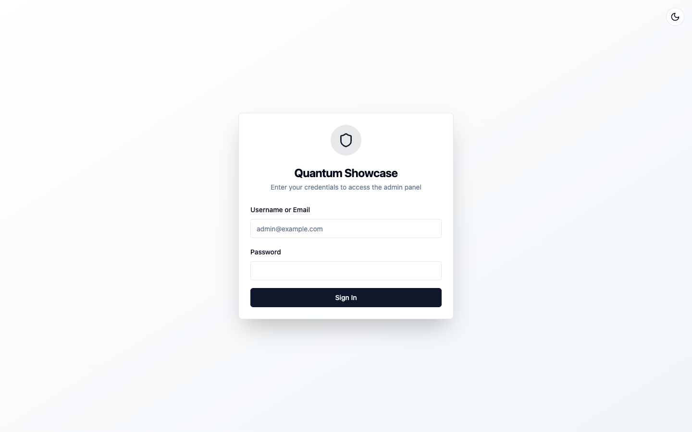

# Quick start

One dependency and one `Mount(...)` call give your Nucleus application a full
admin panel at `/admin` — Data Studio, a live request and SQL feed, sessions,
RBAC and metrics. It is served straight from your own binary: nothing separate
to deploy, no sidecar process, no database of its own.

You need Go 1.26 or newer and a Nucleus application to mount into.

## 1. Add the dependency

```bash
go get github.com/jcsvwinston/orbit@latest
```

The current release is v1.8.19; pin that tag rather than `@latest` for reproducible builds. <!-- x-release-please-version -->

## 2. Mount the module

```go
import (
    "os"

    "github.com/jcsvwinston/nucleus/pkg/nucleus"
    "github.com/jcsvwinston/orbit"
)

func main() {
    app, err := nucleus.New().
        FromConfigFile("nucleus.yml").
        Mount(orbit.Module(orbit.Config{
            Prefix:            "/admin",
            Title:             "Acme Admin",
            BootstrapUsername: "admin",
            BootstrapEmail:    "admin@acme.test",
            // When BootstrapPassword is empty, no admin user is created —
            // provision it another way (e.g. nucleus createuser). The admin
            // users schema is created at mount either way.
            BootstrapPassword: os.Getenv("ADMIN_BOOTSTRAP_PASSWORD"),
        })).
        Build()
    if err != nil {
        panic(err)
    }
    if err := nucleus.Run(app); err != nil {
        panic(err)
    }
}
```

## 3. Start the app and sign in

Run the application, open `/admin`, and sign in as the bootstrap user.



You do not wire up any protection yourself. Orbit registers its prefix with the
framework's default-deny RBAC and enforces its own session-based login below
that prefix, so the panel is gated from the first request.

## 4. Register a model so Data Studio has something to show

Orbit brings no data of its own: Data Studio browses the **host
application's model registry**. If your app registers no models — as the
bare snippet above does — the panel mounts and logs you in, but Data
Studio lists zero models. That is expected, not a broken install.

A model appears in Data Studio the moment your app registers it. In
Nucleus that means listing the struct in a module's `Models` and making
sure its table exists:

```go
import (
    "context"

    "github.com/jcsvwinston/nucleus/pkg/model"
    "github.com/jcsvwinston/nucleus/pkg/nucleus"
)

type Note struct {
    model.BaseModel

    Title string `db:"required" json:"title" validate:"required"`
    Body  string `json:"body"`
}

func notesModule() nucleus.ModuleSpec {
    return nucleus.Module[struct{}]{
        Name:   "notes",
        Models: []any{Note{}}, // ← this line puts Note in Data Studio
        OnStart: func(_ context.Context, rt nucleus.Runtime, _ struct{}) error {
            // Dev-mode convenience; production apps use SQL migrations.
            return rt.AutoMigrate(Note{})
        },
    }.Build()
}
```

Mount it next to Orbit — order does not matter:

```go
nucleus.New().
    FromConfigFile("nucleus.yml").
    Mount(notesModule()).
    Mount(orbit.Module(orbit.Config{ /* ... */ })).
    Build()
```

Restart, open Data Studio, and `Note` is there — browse, create, edit,
delete. Every model your application registers shows up the same way;
Orbit needs no per-model configuration.

Model registration is a Nucleus concept, not an Orbit one — see the
[Nucleus quickstart](/nucleus/getting-started/quickstart) and
[models and database](/nucleus/concepts/models-and-database) for tags,
relations, and real migrations. The runnable
[`examples/minimal`](https://github.com/jcsvwinston/orbit/tree/main/examples/minimal)
in the repository is exactly this page as a program: one `Note` model, one
`Mount`, a populated Data Studio.

## The bootstrap user

Orbit creates the `nucleus_admin_users` schema every time it mounts.
`BootstrapPassword` only decides whether an admin **user** is created in it:

- **Set** — on first start Orbit creates the user named by
  `BootstrapUsername`, unless that user already exists.
- **Empty** — no admin user is created. Provision one another way, for
  example with the framework's `nucleus createuser` command against the same
  database, before you try to sign in. Because the schema already exists
  after the first start, `createuser` works right away — no bootstrap
  password is ever required.

Reading the password from the environment, as the snippet above does, keeps it
out of your source tree.

## Every option has a default

`orbit.Config`'s zero value is valid. This mounts the panel under `/admin` with
default settings and no bootstrap user:

```go
.Mount(orbit.Module(orbit.Config{}))
```

Next: [Configuration](./configuration.md) for every option, or
[How it works](./how-it-works.md) for the runtime model.
